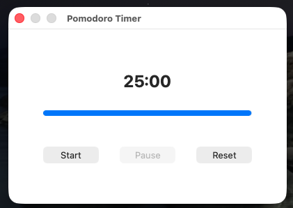
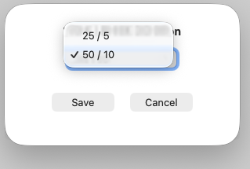

# pomodor-timer

Timer Pomodoro yang ringan dan bebas gangguan, dibangun secara native untuk macOS menggunakan Cocoa (AppKit) dan Objective-C.

<p align="center">
<a href="https://andiahmads.github.io/pomodoro-timer/"></a>
</p>

<p align="center">
<a href="https://andiahmads.github.io/pomodoro-timer/"></a>
</p>


# ✨ Fitur Utama
- Native macOS Experience: Dibangun dengan Cocoa Framework (AppKit) untuk performa, stabilitas, dan feel yang autentik ala Mac.

- Minimal & Fokus: Antarmuka yang bersih dan bebas dari gangguan, membantu Anda tetap fokus pada pekerjaan.

- Notifikasi Sistem: Pemberitahuan native macOS akan muncul saat sesi timer berakhir.

- Ringan dan Efisien: Konsumsi sumber daya yang sangat rendah karena berjalan secara native.
- ada fitur suara hujan yang akan auto play ketika sesi dimulai
- ada fitu setting untuk memilih sesi 25/5 atau 50/10.

# Getting Started
## compiled
Run:
```console
make 
```
## run
Run:
```console
open PomodoroTimer.app
```


