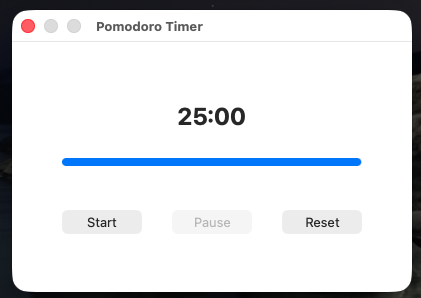

# pomodor-timer

Timer Pomodoro yang ringan dan bebas gangguan, dibangun secara native untuk macOS menggunakan Cocoa (AppKit) dan Objective-C.

<p align="center">
<a href="https://andiahmads.github.io/pomodoro-timer/"></a>
</p>

<p align="center">
<a href="https://andiahmads.github.io/pomodoro-timer/"></a>
</p>


# ✨ Fitur Utama
- Native macOS Experience: Dibangun dengan Cocoa Framework (AppKit) untuk performa, stabilitas, dan feel yang autentik ala Mac.

- Minimal & Fokus: Antarmuka yang bersih dan bebas dari gangguan, membantu Anda tetap fokus pada pekerjaan.

- Notifikasi Sistem: Pemberitahuan native macOS akan muncul saat sesi timer berakhir.

- Ringan dan Efisien: Konsumsi sumber daya yang sangat rendah karena berjalan secara native.

- Menu Bar App: Timer berjalan di menu bar dengan kontrol Start/Pause/Reset.

- Keyboard Shortcuts: Cmd+Shift+P (Start/Pause), Cmd+Shift+R (Reset) - bekerja bahkan saat app di background.

- Dark Mode Support: UI menyesuaikan tema sistem otomatis.

- Task/Todo List: Kelola daftar tugas dan track pomodoros per task.

- Statistik & Pelacakan: Lihat progress harian dan weekly history.

- Deep Focus Sessions: Pilihan durasi 25/5, 50/10, 60/15, atau 90/20 menit.

- Sound Effects: Auto-play suara ambient saat sesi dimulai.

# Getting Started
## compiled
Run:
```console
make 
```
## run
Run:
```console
open PomodoroTimer.app
```

# Roadmap
Fitur berikut belum diimplementasikan (membutuhkan project setup terpisah):
- Widget Notification Center (memerlukan WidgetKit extension)
- Siri Shortcuts (memerlukan App Intents framework)


