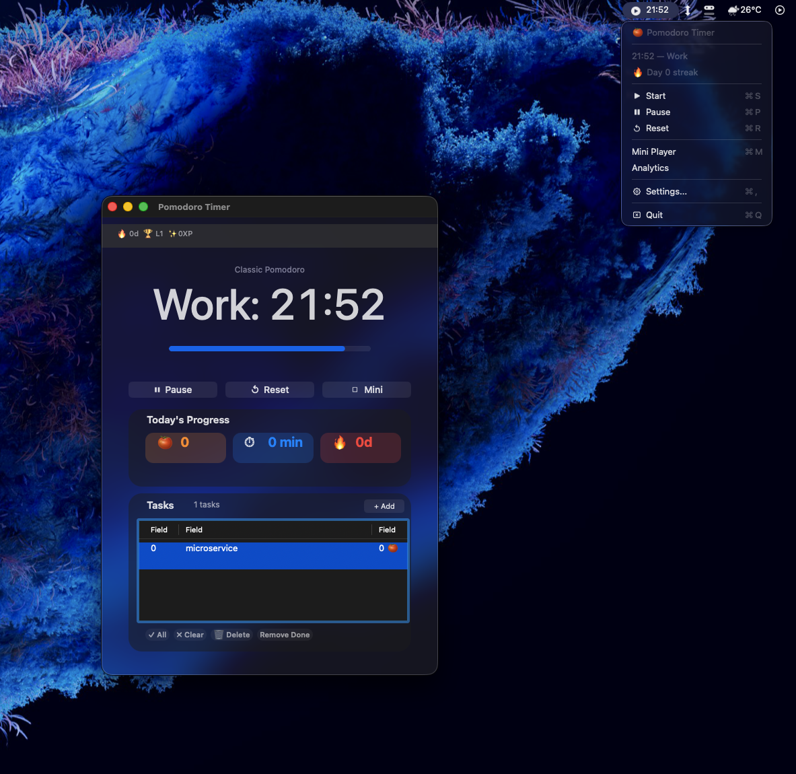
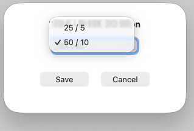

# Pomodoro Timer

Timer Pomodoro native macOS yang ringan dan bebas gangguan, dibangun dengan Cocoa (AppKit) dan Objective-C.

<p align="center">
<a href="https://andiahmads.github.io/pomodoro-timer/"></a>
</p>

<p align="center">
<a href="https://andiahmads.github.io/pomodoro-timer/"></a>
</p>

## Table of Contents

- [Fitur Utama](#fitur-utama)
  - [Five Focus Modes](#five-focus-modes)
  - [Core Timer](#core-timer)
  - [Menu Bar App](#menu-bar-app)
  - [Mini Player Mode](#mini-player-mode)
  - [Task / Todo List](#task--todo-list)
  - [Gamification System](#gamification-system)
  - [Statistics & Analytics](#statistics--analytics)
  - [Focus Sound Mixer](#focus-sound-mixer)
  - [Calendar Integration](#calendar-integration)
  - [System Integration](#system-integration)
- [Getting Started](#getting-started)
- [Roadmap](#roadmap)

---

## Fitur Utama

### Five Focus Modes

Lima mode fokus yang masing-masing dirancang untuk kebutuhan berbeda:

| Mode | Work | Break | Long Break | Sessions | Auto-Start | DND |
|---|---|---|---|---|---|---|
| **Classic Pomodoro** | 25 min | 5 min | 15 min | 4 | No | No |
| **Deep Work** | 90 min | 20 min | 30 min | 2 | Yes | Yes |
| **Timeboxing** | 50 min | 10 min | 30 min | 3 | Yes | Yes |
| **Spicy Mode** | 25 min | 5 min | 10 min | 4 | No | No |
| **Marathon** | 60 min | 10 min | 30 min | 4 | Yes | Yes |

Pilih mode melalui Settings window (Cmd+,).

### Core Timer

- Countdown display real-time dalam format MM:SS
- Progress bar visual yang menunjukkan sisa waktu
- Kontrol Start, Pause, Reset
- Session counter yang melacak jumlah sesi kerja selesai
- Transisi otomatis antara sesi kerja dan istirahat
- Long break otomatis setiap 4 sesi (tergantung mode)
- Sistem notifikasi native macOS saat sesi berakhir ("Break Time!" / "Focus Time!")

### Menu Bar App

- Timer berjalan di menu bar sistem macOS
- Tampilan countdown dan indikator tipe sesi saat ini
- Kontrol Start/Pause/Reset langsung dari menu bar
- Ikon SF Symbol yang adaptif (macOS 11+)
- Streak counter di menu bar
- Streak tetap aktif bahkan saat app di-minimize

### Mini Player Mode

- Floating window borderless (200x50 px)
- Menampilkan waktu dan tombol play/pause
- Draggable — bisa diposisikan di mana saja di layar
- Toggle antara main window dan mini player

### Task / Todo List

- Tambah tugas dengan judul dan pomodoro count
- Table view dengan kolom: checkbox, judul, jumlah pomodoro
- Toggle selesai/belum selesai per task
- Hapus tugas: selected, completed, atau semua
- Data tersimpan di `~/Library/Application Support/PomodoroTimer/tasks.json`

### Gamification System

**XP & Leveling**
- XP diperoleh per pencapaian (10 – 1000 XP)
- Formula level: `level = sqrt(xp/100) + 1`
- Progress bar XP di dashboard

**11 Achievement yang Dilacak:**

| Achievement | Syarat | XP |
|---|---|---|
| First Step | 1 pomodoro pertama | 10 |
| Getting Warmed Up | 10 pomodoros | 50 |
| Half Century | 50 pomodoros | 250 |
| Century Club | 100 pomodoros | 500 |
| Marathon Runner | 4 pomodoros dalam 1 hari | 100 |
| Getting Started | Streak 3 hari | 75 |
| Week Warrior | Streak 7 hari | 300 |
| Monthly Master | Streak 30 hari | 1000 |
| Early Bird | Pomodoro sebelum jam 8 pagi | 100 |
| Night Owl | Pomodoro setelah jam 10 malam | 100 |
| Consistent Contributor | 35 pomodoros dalam 1 minggu | 350 |

**Streak Tracking**
- Counter streak harian dan streak terpanjang
- Streak reset otomatis jika ada hari terlewat
- Data tersimpan di `gamification.json`

### Statistics & Analytics

- **Weekly Bar Chart** — distribusi pomodoro per hari (Mon–Sun)
- **Total Pomodoros** — hitungan all-time
- **Current Streak & Longest Streak**
- **Level & XP Progress Bar**
- **Sessions Today** — hitungan sesi hari ini
- **30-Day Heatmap** — color-coded grid berdasarkan jumlah pomodoro per hari
- Weekly stats dihitung dari `records.json`

### Focus Sound Mixer

6 ambient sound layers yang bisa dicampur:

| Sound | Keterangan |
|---|---|
| Rain | Hujan |
| Forest | Suasana hutan |
| Cafe | Kedai kopi |
| Ocean | Ombak laut |
| Fireplace | Api unggun |
| White Noise | White noise |

- Slider volume per sound (individual)
- Toggle on/off per sound
- Tombol Stop All
- Semua sound looping indefinitely saat aktif
- Sistem sound effect: fireplace.mp3 (loop saat work), alarm-clock.mp3 (single play saat break)

### Calendar Integration

- Integrasi EventKit dengan kalender macOS
- Sync sesi work dan break sebagai event ke macOS Calendar
- Events berjudul "Pomodoro: Work" dan "Pomodoro: Break"
- Toggle on/off melalui Settings window
- Memerlukan permission akses kalender

### System Integration

- **Do Not Disturb** — auto-enable DND saat mode Deep Work, Timeboxing, dan Marathon
- **iCloud Sync** — NSUbiquitousKeyValueStore untuk backup cloud:
  - Streak, total pomodoros, XP
  - Last sync timestamp
- **Dark Mode** — NSVisualEffectView dengan HUD material, adaptif terhadap tema sistem
- **Keyboard Shortcuts:**
  - `Cmd+Shift+P` — Start/Pause (berfungsi bahkan saat app di background)
  - `Cmd+Shift+R` — Reset
  - `Cmd+,` — Settings
  - `Cmd+Q` — Quit

---

## Getting Started

### Compile

```console
make
```

### Run

```console
open PomodoroTimer.app
```

### Data Storage

Semua data tersimpan sebagai JSON di `~/Library/Application Support/PomodoroTimer/`:
- `tasks.json` — daftar tugas
- `records.json` — catatan pomodoro harian
- `gamification.json` — streak, XP, achievement

---

## Roadmap

Fitur berikut belum diimplementasikan (membutuhkan project setup terpisah):

- Widget Notification Center (memerlukan WidgetKit extension)
- Siri Shortcuts (memerlukan App Intents framework)
- Team Mode (memerlukan backend service)
